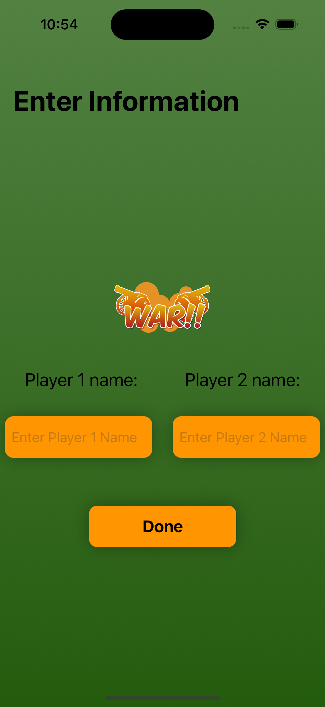
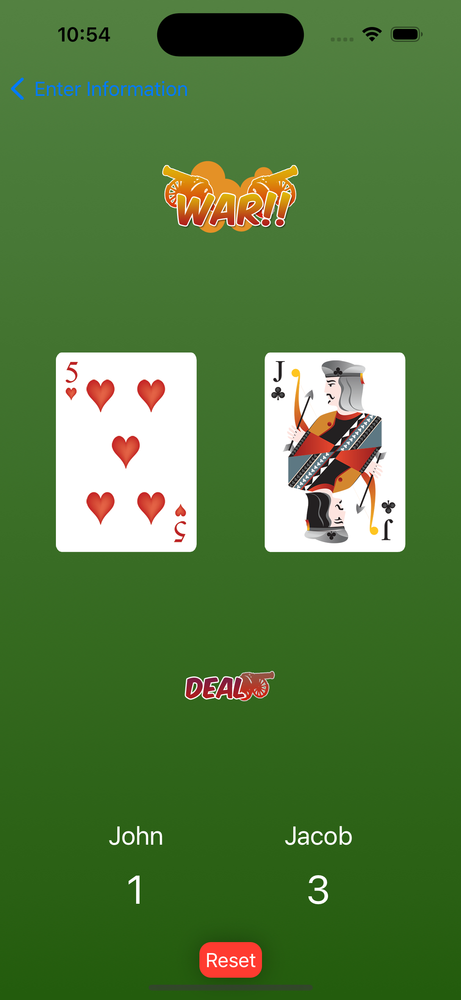

# iosWarGame

A simple card game made while going through the 14 day begginer challenge at learn.codewithchris.com. I modified the tutorial quite a bit by: adding a start screen to enter player names, used navigational links to change between views, and added a reset button so the game can be played over again without exiting the app.

